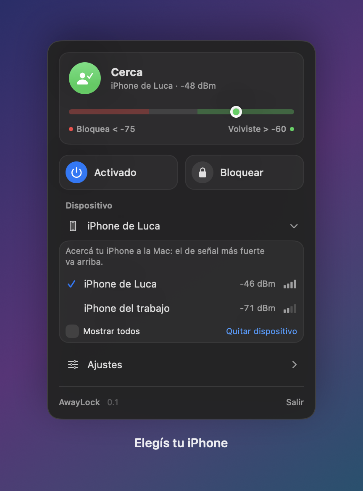
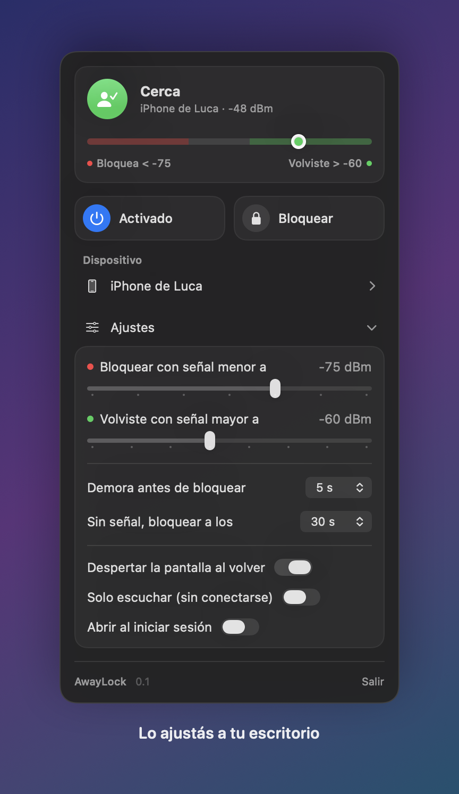

<div align="center">

# AwayLock

**Tu Mac se bloquea sola cuando te alejás con el iPhone.**
Volvés y tu Apple Watch te la desbloquea. Sin tocar nada.


</div>

---

## ✨ Cómo funciona

| | |
|:-:|---|
| 📱 | **Llevás el iPhone encima.** AwayLock escucha su señal Bluetooth desde la barra de menú. |
| 🚶 | **Te levantás y te vas.** Cuando la señal baja, espera unos segundos por las dudas… y bloquea la Mac. |
| ⌚ | **Volvés.** Te prende la pantalla y tu Apple Watch la desbloquea como siempre. |

Nada de guardar tu contraseña ni de permisos raros: AwayLock solo **bloquea**. El desbloqueo lo sigue haciendo macOS (Apple Watch, Touch ID o tu contraseña).

## 🎛️ Todo en un panel

<p align="center">
  
  &nbsp;
  
</p>

- **Medidor de señal en vivo**: ves dónde está tu iPhone entre la zona roja (bloquea) y la verde (volviste).
- **Elegís tu iPhone** de una lista que solo muestra iPhones, sin mezclarlo con el reloj ni los AirPods.
- **Lo ajustás a tu escritorio**: qué tan lejos bloquea, cuánto espera y qué pasa al volver.
- **Botón para pausar** cuando no lo necesitás y otro para **bloquear ya**.

## 🚀 Instalación

Necesitás una Mac con macOS 13 o posterior y Xcode (o sus herramientas de línea de comandos).

```bash
git clone <este-repo> AwayLock
cd AwayLock
./build.sh
cp -R build/AwayLock.app /Applications/
open /Applications/AwayLock.app
```

La primera vez te va a pedir permiso de **Bluetooth**: aceptalo.

## 🧭 Primeros pasos

1. Hacé clic en el ícono 📱 de la barra de menú.
2. Abrí **Dispositivo**, acercá tu iPhone a la Mac y elegilo.
3. Mirá el medidor sentado como siempre, después alejate hasta donde querés que bloquee. Con eso ajustás las dos marcas en **Ajustes**.

> 💡 Si activás **Abrir al iniciar sesión**, AwayLock arranca solo cada vez que prendés la Mac.

## 🤔 Preguntas frecuentes

<details>
<summary><b>¿Me puede quedar bloqueando una y otra vez?</b></summary>

No. Después de bloquear, AwayLock no vuelve a hacerlo hasta que te detecta bien cerca otra vez. Y si te desbloqueás, te da unos segundos de gracia. Si alguna vez te bloquea estando sentado, el panel te avisa y te sugiere qué ajustar.
</details>

<details>
<summary><b>¿Guarda mi contraseña?</b></summary>

No. Nunca te la pide. Solo bloquea; desbloquear sigue siendo cosa de macOS.
</details>

<details>
<summary><b>¿Y si dejo el iPhone en el escritorio?</b></summary>

Entonces la Mac no se va a bloquear, porque para AwayLock seguís ahí. Funciona cuando llevás el iPhone encima.
</details>

<details>
<summary><b>¿Qué pasa cuando cierro la tapa o la Mac se duerme?</b></summary>

Al despertar arranca de cero y espera a verte cerca antes de volver a vigilar, así no te bloquea apenas abrís la compu.
</details>

<details>
<summary><b>¿Puedo usarlo con otro dispositivo en vez del iPhone?</b></summary>

Sí: en la lista de dispositivos tildá **Mostrar todos** y elegí el que quieras (por ejemplo tu Apple Watch).
</details>

---

<details>
<summary>🛠️ Para desarrolladores</summary>

- `swift test` corre las pruebas de la lógica que decide cuándo bloquear.
- `swift run AwayLock --snapshots docs` regenera las imágenes de este README con datos de ejemplo.
- `Sources/AwayLockCore` tiene la lógica pura; `Sources/AwayLock` el Bluetooth, la pantalla y el panel.

</details>
