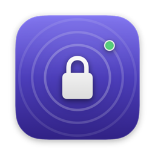
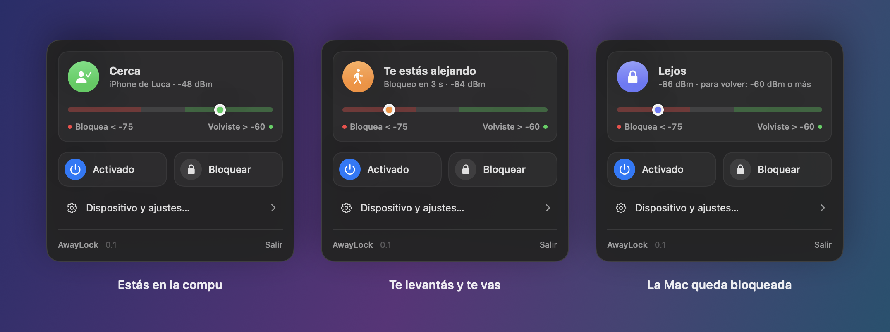
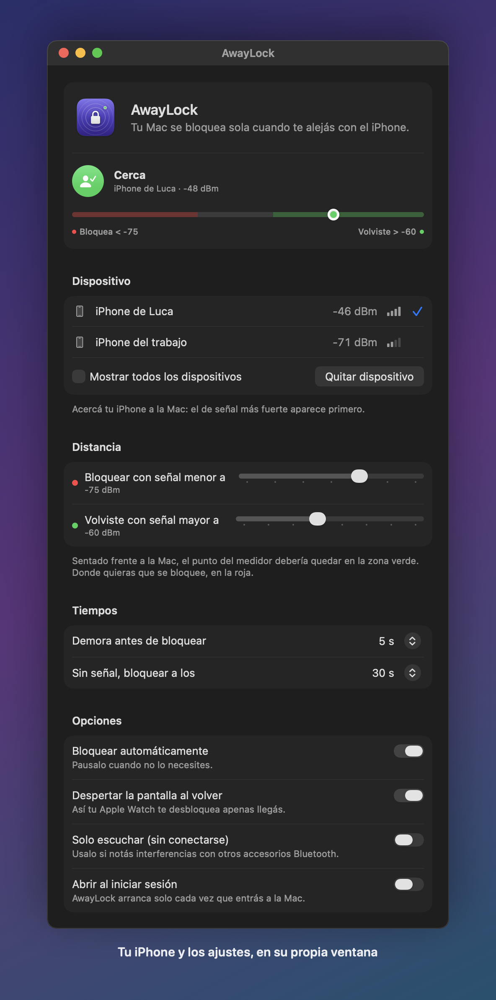

<div align="center">



# AwayLock

**Tu Mac se bloquea sola cuando te alejás con el iPhone.**<br>
Volvés y tu Apple Watch te la desbloquea, sin tocar nada.

[](https://github.com/Lucavcolazo/AwayLock/releases/latest)

[](LICENSE)

[**Descargar**](https://github.com/Lucavcolazo/AwayLock/releases/latest) · [Sitio](https://lucavcolazo.github.io/AwayLock/) · [English](README.en.md)



</div>

## Cómo funciona

1. **Llevás el iPhone encima.** AwayLock escucha su señal Bluetooth desde la barra de menú.
2. **Te levantás y te vas.** Cuando la señal baja, espera unos segundos por las dudas y bloquea la Mac.
3. **Volvés.** Te prende la pantalla y tu Apple Watch la desbloquea como siempre.

AwayLock solo **bloquea**. No guarda tu contraseña ni pide permisos de Accesibilidad: el desbloqueo lo sigue haciendo macOS, con el Apple Watch, Touch ID o tu contraseña.

## Descargar e instalar

1. Descargá el `.zip` de la [última versión](https://github.com/Lucavcolazo/AwayLock/releases/latest) y descomprimilo.
2. Mové **AwayLock.app** a **Aplicaciones**.
3. Abrila. Te va a pedir permiso de **Bluetooth**: aceptalo.

> [!IMPORTANT]
> **La primera vez macOS la va a bloquear.** AwayLock no está firmada con una cuenta paga de desarrollador de Apple, así que macOS avisa que no puede verificarla. Para abrirla:
>
> 1. Intentá abrir AwayLock y cerrá el aviso (no la mandes a la papelera).
> 2. Andá a **Ajustes del Sistema → Privacidad y seguridad**.
> 3. Bajá hasta el mensaje sobre AwayLock y tocá **Abrir igualmente**.
>
> Solo hace falta una vez. Si preferís la Terminal, esto hace lo mismo:
>
> ```bash
> xattr -dr com.apple.quarantine /Applications/AwayLock.app
> ```
>
> El código es abierto: si no querés confiar en el archivo descargado, podés [compilarla vos](#compilar-desde-el-código).

### Requisitos

- Una Mac con Bluetooth, con chip Apple o Intel.
- macOS 13 o posterior. Por ahora está probada en macOS 26; si la usás en otra versión, [contanos cómo te fue](https://github.com/Lucavcolazo/AwayLock/issues/new/choose).
- Un iPhone con la **misma cuenta de Apple** que la Mac. Así la Mac lo reconoce siempre, aunque el iPhone cambie su dirección Bluetooth por privacidad.
- Opcional: un Apple Watch con **Ajustes del Sistema → Touch ID y contraseña → Apple Watch** activado, para que te desbloquee al volver. Sin reloj funciona igual, y desbloqueás con Touch ID o contraseña.

## Primeros pasos

1. La primera vez se abre la ventana de AwayLock sola. Si no, abrila desde Aplicaciones o tocá **Dispositivo y ajustes…** en la barra de menú.
2. Acercá tu iPhone a la Mac y elegilo en **Dispositivo**.
3. Mirá el medidor sentado como siempre y después alejate hasta donde querés que bloquee. Con eso ajustás las dos marcas de **Distancia**.

Si activás **Abrir al iniciar sesión**, AwayLock arranca solo cada vez que entrás a la Mac.

## La app

**En la barra de menú** está lo del día a día: si estás cerca, alejándote o lejos, el medidor de señal en vivo, y los botones para pausar y para bloquear ya.

**En la ventana** está todo lo demás: elegir tu iPhone, cuánta distancia hace falta para bloquear, los tiempos y las opciones. Mientras está abierta, AwayLock aparece en el Dock como cualquier app.

<p align="center">
  
</p>

## Privacidad

AwayLock no se conecta a internet, no recolecta datos y no guarda tu contraseña. Lo único que hace es medir la señal Bluetooth de tu iPhone, y todo pasa en tu Mac.

## Preguntas frecuentes

<details>
<summary><b>¿Me puede quedar bloqueando una y otra vez?</b></summary>
<br>

No. Después de bloquear, AwayLock no vuelve a hacerlo hasta que te detecta bien cerca otra vez, y cuando te desbloqueás te da unos segundos de gracia. Si alguna vez te bloquea estando sentado, el panel te avisa y te sugiere qué ajustar.
</details>

<details>
<summary><b>¿Gasta mucha batería?</b></summary>
<br>

No. Usa Bluetooth de bajo consumo, el mismo tipo de conexión que el iPhone ya mantiene con el reloj o los AirPods. Con el panel cerrado, la app prácticamente no usa CPU. Si querés el mínimo posible, activá **Solo escuchar (sin conectarse)**.
</details>

<details>
<summary><b>¿Y si dejo el iPhone en el escritorio?</b></summary>
<br>

Entonces la Mac no se bloquea, porque para AwayLock seguís ahí. Funciona cuando llevás el iPhone encima.
</details>

<details>
<summary><b>¿Qué pasa cuando cierro la tapa o la Mac se duerme?</b></summary>
<br>

Al despertar arranca de cero y espera a verte cerca antes de volver a vigilar, así no te bloquea apenas abrís la compu.
</details>

<details>
<summary><b>No aparece mi iPhone en la lista</b></summary>
<br>

La lista muestra solo los dispositivos cuyo nombre incluye "iPhone". Si le cambiaste el nombre, tildá **Mostrar todos los dispositivos**. Acordate también de que el iPhone tiene que estar en la misma cuenta de Apple que la Mac.
</details>

<details>
<summary><b>¿Puedo usarla con otro dispositivo en vez del iPhone?</b></summary>
<br>

Sí. En la ventana, tildá **Mostrar todos los dispositivos** y elegí el que quieras, por ejemplo tu Apple Watch.
</details>

<details>
<summary><b>¿En qué se diferencia de BLEUnlock?</b></summary>
<br>

[BLEUnlock](https://github.com/ts1/BLEUnlock) es un gran proyecto que además desbloquea la Mac escribiendo tu contraseña, que guarda en el Llavero y tipea con permiso de Accesibilidad. AwayLock está escrita desde cero con otro enfoque: solo bloquea y deja el desbloqueo al Apple Watch, así nunca toca tu contraseña.
</details>

## Reportar un problema

Es un proyecto nuevo, así que tu experiencia sirve mucho. Si algo no anda, [abrí un issue](https://github.com/Lucavcolazo/AwayLock/issues/new/choose): el formulario te pide el modelo de Mac, la versión de macOS y qué señal marca sentado, que es lo que hace falta para entender qué pasa.

## Compilar desde el código

Necesitás Xcode o sus herramientas de línea de comandos.

```bash
git clone https://github.com/Lucavcolazo/AwayLock.git
cd AwayLock
./install.sh
```

`install.sh` compila la app, la copia a Aplicaciones y la abre. Para actualizarla después de un cambio, volvé a correrlo.

<details>
<summary>Para desarrolladores</summary>
<br>

- `swift test` corre las pruebas de la lógica que decide cuándo bloquear.
- `swift run AwayLock --snapshots docs` regenera las imágenes de este README con datos de ejemplo.
- `./scripts/make-icon.sh` regenera el ícono a partir de `scripts/icon.swift`.
- `./scripts/release.sh` arma `dist/AwayLock-<versión>.zip`. Al subir un tag `vX.Y.Z`, GitHub Actions lo arma y publica el Release solo.
- `site/` es la landing (HTML, CSS y JS sin dependencias). Se publica sola en GitHub Pages al cambiar en `main`. `swift scripts/og-image.swift site/assets/og.png` regenera su imagen de vista previa.
- `./scripts/render-promo.sh` genera el video promocional de 15 s (`dist/awaylock-promo.mp4`) a partir de `promo/`. Para verlo en el navegador, serví la carpeta del repo y abrí `promo/`.
- `Sources/AwayLockCore` tiene la lógica pura; `Sources/AwayLock`, el Bluetooth, la pantalla y la interfaz.

</details>

## Licencia

[MIT](LICENSE)
